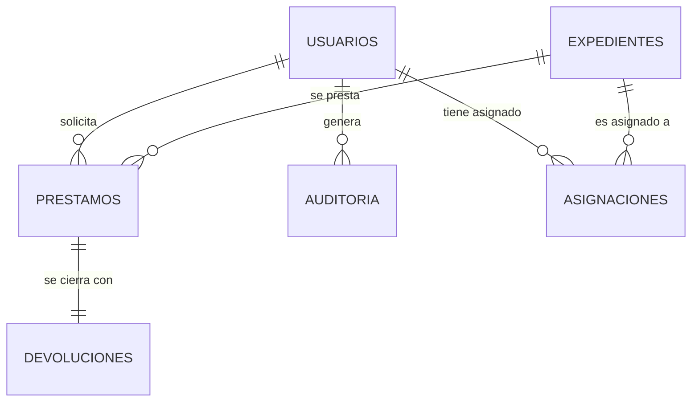

# 🏛️ SGD CAS - Sistema de Gestión Documental

Sistema de Gestión Documental institucional diseñado para la **CAS**, desarrollado bajo un patrón de arquitectura **MVC personalizado en PHP** y una interfaz moderna con estilo **Glassmorphism**. 

Este sistema gestiona el flujo de control, préstamo y devolución física de expedientes utilizando un modelo híbrido de persistencia y un flujo estricto de doble verificación.

---

## 🚀 Características Principales

*   **Persistencia Dual:** Arquitectura configurada para persistencia plana basada en archivos JSON (`JsonDB`) con transición diseñada a base de datos relacional SQL (MySQL/MariaDB).
*   **Enrutador Personalizado:** Motor de rutas ligero basado en expresiones regulares (Regex) sin dependencias externas pesadas.
*   **Diseño Institucional Premium:** Interfaz de usuario responsiva y moderna implementada en Vanilla CSS y JavaScript con efectos de desenfoque y transparencias (Glassmorphism).
*   **Control de Acceso Basado en Asignaciones:** Los usuarios solo pueden visualizar e interactuar con los expedientes que su **Jefe de Línea** o **Administrador** les ha asignado previamente.
*   **Auditoría Integral:** Registro de cada transacción o cambio de metadatos en la bitácora de auditoría para el cumplimiento de normativas de archivo.

---

## 📊 Arquitectura de Datos y Relaciones

El diseño relacional detallado en [schema.sql](file:///c:/xampp/htdocs/Practicas-Hayder-2026-1/Gestion_Documental/database/schema.sql) consta de **13 tablas** para normalizar el flujo:



### Entidades Core
*   **`expedientes`**: Almacena los 19 campos técnicos normalizados de archivo (No. de orden, código, serie/subserie, caja, carpeta, tomos, folios, soporte, ubicación física, etc.).
*   **`prestamos`**: Controla el estado del flujo (`pendiente_prestamo`, `entregado`, `devuelto`, `vencido`).
*   **`devoluciones`**: Registra la foliación, tomos retornados, estado físico y las decisiones de aceptación o rechazo.
*   **`usuarios`**: Soporta tres roles jerárquicos: `Administrador`, `Jefe de Línea` y `Usuario`.

---

## 🔄 Flujo de Trabajo y Doble Verificación (Workflow CAS)

El sistema implementa un riguroso control de seguridad física para evitar pérdida de documentos:

```
[Jefe de Línea] ──► Asigna Expediente a Usuario 
                        │
                        ▼
[Usuario]       ──► Solicita Préstamo (Solo de asignados)
                        │
                        ▼
[Administrador] ──► Entrega Física y Aprueba (Estado: Prestado)
                        │
                        ▼
[Usuario]       ──► Reporta Retorno y datos de folios/tomos
                        │
                        ▼
[Administrador] ──► Validación Física:
                        ├─ Acepta: Expediente Disponible.
                        └─ Rechaza: Vuelve a "Entregado" para corrección.
```

---

## 📂 Estructura del Proyecto

*   [`app/`](file:///c:/xampp/htdocs/Practicas-Hayder-2026-1/Gestion_Documental/app): Código fuente principal del patrón MVC.
    *   [`app/config/Database.php`](file:///c:/xampp/htdocs/Practicas-Hayder-2026-1/Gestion_Documental/app/config/Database.php): Adaptador de conexión PDO para MySQL.
    *   [`app/controllers/`](file:///c:/xampp/htdocs/Practicas-Hayder-2026-1/Gestion_Documental/app/controllers): Controladores del flujo de negocio.
    *   [`app/models/`](file:///c:/xampp/htdocs/Practicas-Hayder-2026-1/Gestion_Documental/app/models): Lógica de acceso y mapeo de datos.
    *   [`app/views/`](file:///c:/xampp/htdocs/Practicas-Hayder-2026-1/Gestion_Documental/app/views): Vistas de usuario estructuradas.
*   [`database/`](file:///c:/xampp/htdocs/Practicas-Hayder-2026-1/Gestion_Documental/database): Persistencia de datos.
    *   [`database/schema.sql`](file:///c:/xampp/htdocs/Practicas-Hayder-2026-1/Gestion_Documental/database/schema.sql): Esquema físico DDL para MySQL/MariaDB.
    *   [`database/data/`](file:///c:/xampp/htdocs/Practicas-Hayder-2026-1/Gestion_Documental/database/data): Base de datos plana temporal basada en JSON.
*   [`documentacion/`](file:///c:/xampp/htdocs/Practicas-Hayder-2026-1/Gestion_Documental/documentacion): Diagramas de contexto, contenedores y Modelo ER interactivo.
*   [`public/`](file:///c:/xampp/htdocs/Practicas-Hayder-2026-1/Gestion_Documental/public): Punto de entrada web (`index.php`), estilos CSS globales, e interactividad JS.
*   [`routes/web.php`](file:///c:/xampp/htdocs/Practicas-Hayder-2026-1/Gestion_Documental/routes/web.php): Definición de rutas del sistema.

---

## 🛠️ Requisitos de Instalación

1.  **Servidor Local**: Apache con PHP 8.0 o superior (Recomendado XAMPP/WampServer).
2.  **Configuración de Rutas**: Habilitar el módulo `mod_rewrite` en Apache (configurado mediante el archivo `.htaccess`).
3.  **Configuración de Entorno**: Copiar el archivo `.env.example` a `.env` y configurar las credenciales de base de datos si se desea habilitar el motor SQL en lugar del motor JSON.

---

## 👥 Credenciales de Prueba (Semillas Básicas)

Para ingresar al sistema, utiliza cualquiera de los siguientes accesos por defecto:

*   **Administrador**:
    *   **Usuario**: `admin`
    *   **Contraseña**: `admin123`
*   **Jefe de Línea**:
    *   **Usuario**: `jefe`
    *   **Contraseña**: `123`
*   **Usuario común**:
    *   **Usuario**: `jpererz` o `mrodriguez`
    *   **Contraseña**: `123`
