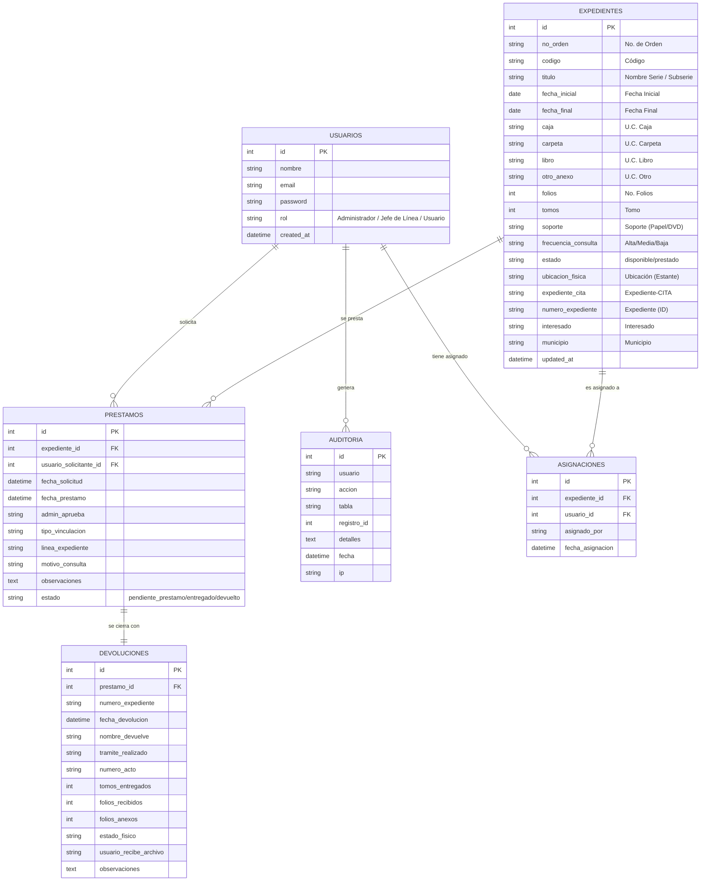

# Esquema de Base de Datos SQL (Tentativo) - SGD-CAS

Este diagrama representa la transición del modelo de persistencia JSON actual a una estructura relacional SQL robusta, incorporando los 19 campos técnicos estandarizados y las relaciones de flujo de préstamo.

## Notas Técnicas del Modelo
*   **Identificadores**: Se recomienda usar `numero_expediente` como índice único (`UNIQUE`) adicional al `id` autoincremental.
*   **Campos de Auditoría**: La tabla `AUDITORIA` es vital para el cumplimiento normativo de archivo, rastreando cada cambio en los 19 metadatos.
*   **Flujo de Préstamo**: La separación entre `PRESTAMOS` y `DEVOLUCIONES` asegura que los datos de foliación final reportados por el usuario no sobreescriban los originales de forma permanente sin pasar por la tabla de control.
