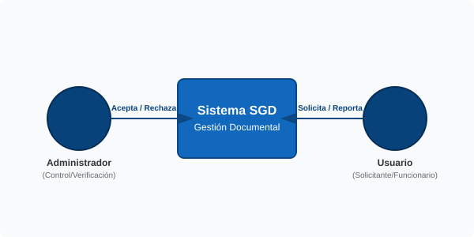
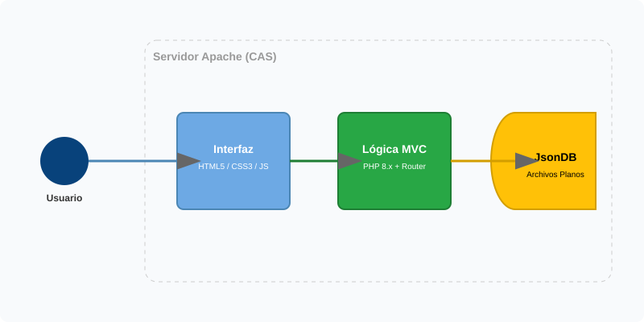
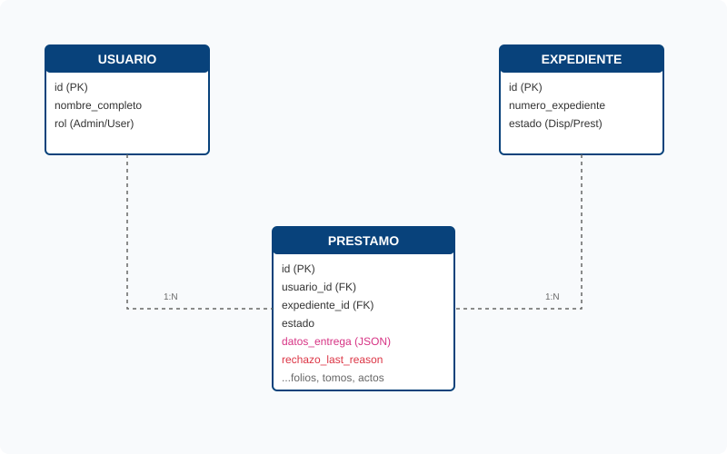

# 🏛️ Documentación Técnica - SGD CAS

Este documento contiene la arquitectura y el modelo de datos unificado del Sistema de Gestión Documental.

---

## 1. Mapa de Contexto (Nivel 1)
Muestra la interacción del personal de la CAS con el sistema SGD.

  

---

## 2. Diagrama de Contenedores (Nivel 2)
Desglose de la tecnología: Servidor Apache, Lógica PHP MVC, Base de Datos SQL (MySQL/MariaDB) y Persistencia JsonDB de respaldo.

  

---

## 3. Modelo Entidad-Relación (Datos)
Estructura de las tablas y relaciones de la base de datos relacional (12 tablas).

  

---

## 4. Resumen Técnico de Componentes

### 🖥️ Interfaz de Usuario
- **Estilo:** Glassmorphism institucional (Premium).
- **Tecnología:** Vanilla CSS, JavaScript, FontAwesome para iconos.

### 🧠 Capa de Aplicación
- **Rutas:** Despachador basado en Regex.
- **Persistencia:** Base de datos relacional SQL (MySQL/MariaDB) con esquema estructurado. Cuenta con una capa de respaldo y pruebas `JsonDB` sobre archivos planos en formato JSON.

### 📁 Archivos y Tablas de Datos
- `expedientes`: Maestro de documentos, metadatos técnicos (tomos, folios, ubicación) y su disponibilidad.
- `prestamos`: Registro de solicitudes, datos de entrega, motivos y línea.
- `usuarios`: Gestión de acceso con roles y permisos asociados (incluye el rol **Jefe de Línea**).
- `asignaciones`: Relación de asignación de expedientes a usuarios encargados.
- `auditoria`: Registro detallado de cada transacción para cumplimiento legal.

---

## 5. Flujo de Trabajo (Workflow CAS)

El sistema implementa un modelo de **Responsabilidad Compartida**, **Control de Acceso por Asignación** y **Doble Verificación**:

### 🔑 Proceso de Asignación (Control de Acceso)
1.  **Asignación:** El **Jefe de Línea** o el **Administrador** accede a la vista de asignación de un expediente.
2.  **Vinculación:** Selecciona uno o varios usuarios a los que asignará el expediente.
3.  **Filtrado:** El sistema restringe la vista del **Usuario** común para que sólo visualice y pueda solicitar préstamos sobre sus expedientes asignados.
4.  **Trazabilidad:** Cada asignación o desasignación se registra en la auditoría del sistema.

### 📥 Proceso de Préstamo
1.  **Solicitud:** El **Usuario** diligencia el formulario indicando motivo y línea (sólo sobre expedientes que tenga asignados).
2.  **Verificación:** El **Administrador** revisa los detalles de la solicitud.
3.  **Aprobación:** El **Administrador** confirma la entrega física y el sistema actualiza el expediente a "Prestado".

### 📤 Proceso de Devolución
1.  **Diligenciamiento:** El **Usuario** reporta el estado técnico del retorno (folios, tomos, trámites).
2.  **Recepción/Verificación:** El **Administrador** verifica físicamente el expediente.
3.  **Decisión Administrativa:**
    *   **Aceptar:** Si todo coincide, el Administrador confirma la recepción y el expediente queda **Disponible**.
    *   **Rechazar:** Si hay inconsistencias, el Administrador registra el motivo del rechazo. El préstamo vuelve a estado **Entregado** y el usuario debe corregir la información.

---

## 🔗 Recursos Adicionales

*   🌐 **[Ver Panel Interactivo en Navegador (HTML)](VER_DIAGRAMAS.html)**
*   🖼️ **[Diagrama Contexto (SVG)](contexto.svg)** | **[Diagrama Contenedores (SVG)](contenedores.svg)** | **[Modelo ER (SVG)](modelo_er.svg)**

---
*Documentación Consolidada para CAS - Mayo 2026*
